Hepatitis C Exploratory Data Analysis
================
Camilo Granda
2022-11-15

IMPORTANT: This exploratory data analysis is for educational purposes
only about R. The statistics and graphs are used merely to explore R
functionalities, not for clinical interpretations.

    ## Warning: package 'dplyr' was built under R version 4.1.3

    ## 
    ## Attaching package: 'dplyr'

    ## The following objects are masked from 'package:stats':
    ## 
    ##     filter, lag

    ## The following objects are masked from 'package:base':
    ## 
    ##     intersect, setdiff, setequal, union

    ##    Patient_ID      Category              Age            Sex           
    ##  Min.   :  1.0   Length:615         Min.   :19.00   Length:615        
    ##  1st Qu.:154.5   Class :character   1st Qu.:39.00   Class :character  
    ##  Median :308.0   Mode  :character   Median :47.00   Mode  :character  
    ##  Mean   :308.0                      Mean   :47.41                     
    ##  3rd Qu.:461.5                      3rd Qu.:54.00                     
    ##  Max.   :615.0                      Max.   :77.00                     
    ##                                                                       
    ##       ALB             ALP              ALT              AST        
    ##  Min.   :14.90   Min.   : 11.30   Min.   :  0.90   Min.   : 10.60  
    ##  1st Qu.:38.80   1st Qu.: 52.50   1st Qu.: 16.40   1st Qu.: 21.60  
    ##  Median :41.95   Median : 66.20   Median : 23.00   Median : 25.90  
    ##  Mean   :41.62   Mean   : 68.28   Mean   : 28.45   Mean   : 34.79  
    ##  3rd Qu.:45.20   3rd Qu.: 80.10   3rd Qu.: 33.08   3rd Qu.: 32.90  
    ##  Max.   :82.20   Max.   :416.60   Max.   :325.30   Max.   :324.00  
    ##  NA's   :1       NA's   :18       NA's   :1                        
    ##       BIL             CHE              CHOL            CREA        
    ##  Min.   :  0.8   Min.   : 1.420   Min.   :1.430   Min.   :   8.00  
    ##  1st Qu.:  5.3   1st Qu.: 6.935   1st Qu.:4.610   1st Qu.:  67.00  
    ##  Median :  7.3   Median : 8.260   Median :5.300   Median :  77.00  
    ##  Mean   : 11.4   Mean   : 8.197   Mean   :5.368   Mean   :  81.29  
    ##  3rd Qu.: 11.2   3rd Qu.: 9.590   3rd Qu.:6.060   3rd Qu.:  88.00  
    ##  Max.   :254.0   Max.   :16.410   Max.   :9.670   Max.   :1079.10  
    ##                                   NA's   :10                       
    ##       GGT              PROT      
    ##  Min.   :  4.50   Min.   :44.80  
    ##  1st Qu.: 15.70   1st Qu.:69.30  
    ##  Median : 23.30   Median :72.20  
    ##  Mean   : 39.53   Mean   :72.04  
    ##  3rd Qu.: 40.20   3rd Qu.:75.40  
    ##  Max.   :650.90   Max.   :90.00  
    ##                   NA's   :1

## Univariate Exploratory Data Analysis

### Categorical Data

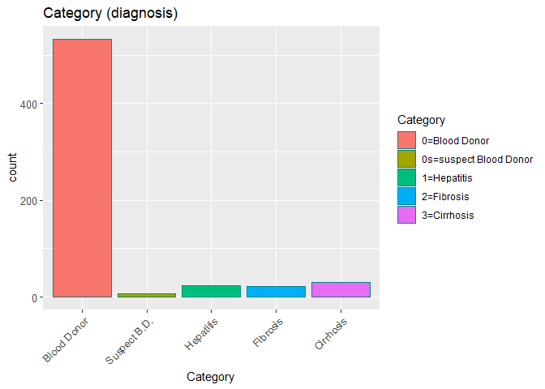<!-- -->
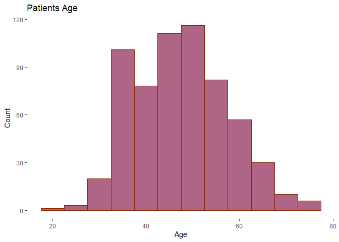<!-- -->
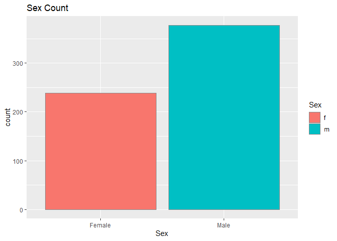<!-- -->

### Numeric Data

    ## Warning: Removed 1 rows containing non-finite values (`stat_bin()`).

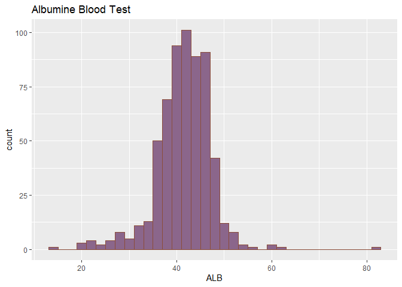<!-- -->

    ## Warning: Removed 18 rows containing non-finite values (`stat_bin()`).

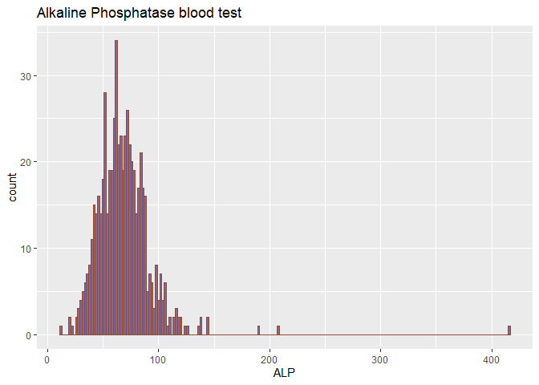<!-- -->

    ## Warning: Removed 1 rows containing non-finite values (`stat_bin()`).

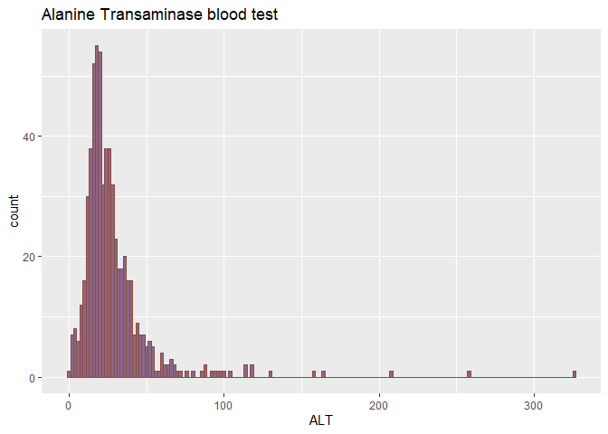<!-- -->

## Multivariate Exploratory Data Analysis

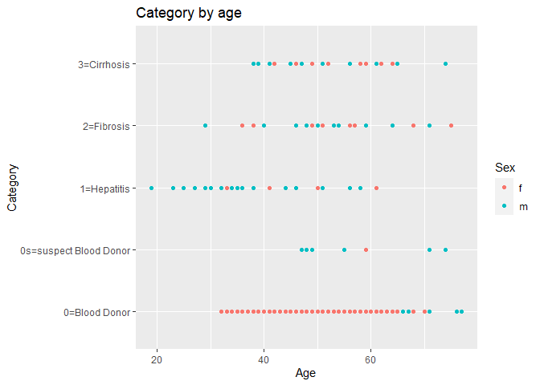<!-- -->

    ## Warning: Using size for a discrete variable is not advised.

    ## Warning: Removed 1 rows containing missing values (`geom_point()`).

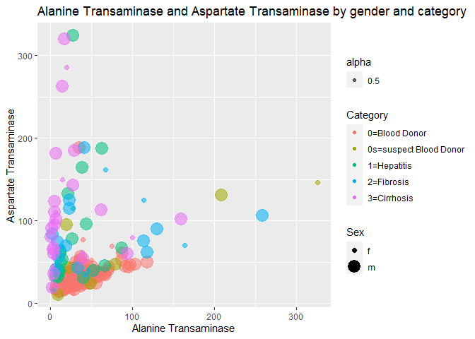<!-- -->

    ## Warning: Using size for a discrete variable is not advised.

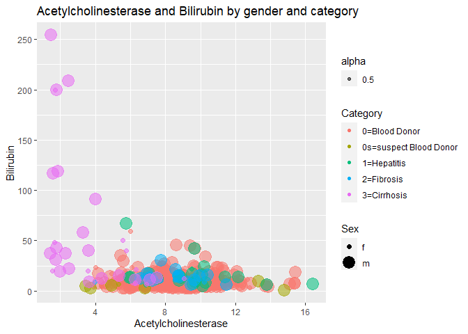<!-- -->

    ## Warning: Using size for a discrete variable is not advised.

    ## Warning: Removed 10 rows containing missing values (`geom_point()`).

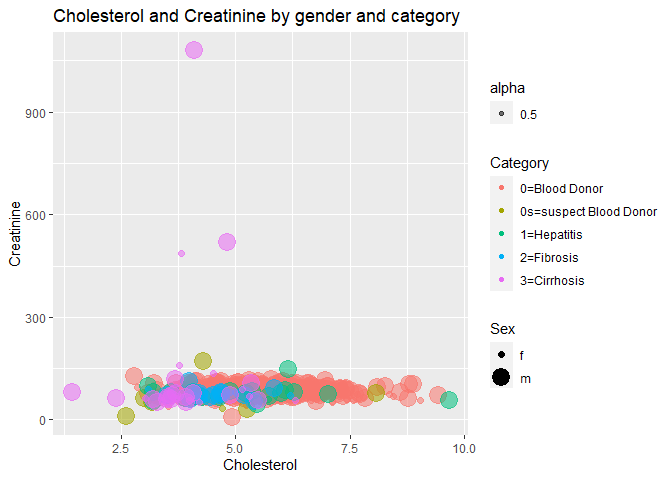<!-- -->

    ## Warning: Using size for a discrete variable is not advised.

    ## Warning: Removed 1 rows containing missing values (`geom_point()`).

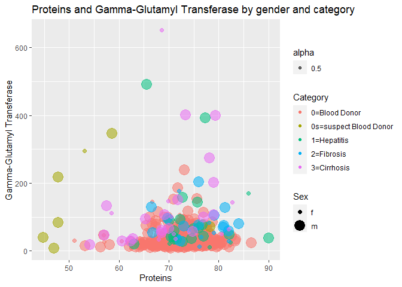<!-- -->
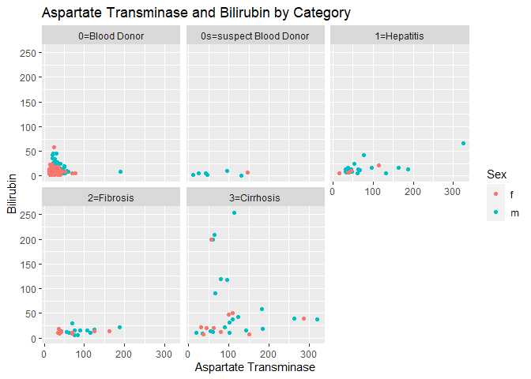<!-- -->

    ## Warning: Removed 1 rows containing missing values (`geom_point()`).

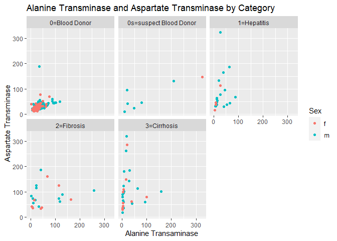<!-- -->
